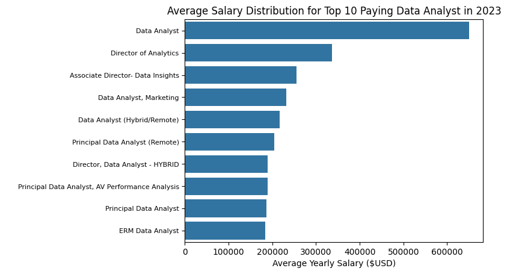

# Введение
📊 Погрузитесь в рынок вакансий в сфере данных! Этот проект посвящен ролям аналитиков данных и изучает 💰 высокооплачиваемые jobs, 🔥 востребованные навыки и 📈 точки, где высокий спрос встречается с высокой зарплатой в аналитике данных.

🔍 SQL-запросы? Посмотрите их здесь: [Папка project_sql](/project_sql/)

# Предыстория
Стремление более эффективно ориентироваться на рынке вакансий для аналитиков данных породило этот проект. Его цель — определить самые высокооплачиваемые и востребованные навыки, чтобы упростить для других поиск оптимальных вакансий.

Данные взяты из [Курса SQL](https://lukebarousse.com/sql). Они содержат информацию о должностях, зарплатах, местоположении и ключевых навыках.

### Вопросы, на которые я хотел ответить с помощью SQL-запросов:

1.  Какие самые высокооплачиваемые вакансии для аналитиков данных?
2.  Какие навыки требуются для этих высокооплачиваемых вакансий?
3.  Какие навыки наиболее востребованы для аналитиков данных?
4.  Какие навыки ассоциируются с более высокими зарплатами?
5.  Какие навыки наиболее оптимальны для изучения?

# Использованные инструменты
Для глубокого погружения в рынок вакансий аналитиков данных я использовал несколько ключевых инструментов:

-   **SQL:** Основа моего анализа, позволяющая мне запрашивать базу данных и извлекать важные сведения.
-   **PostgreSQL:** Выбранная система управления базами данных, идеально подходящая для работы с данными о вакансиях.
-   **Visual Studio Code:** Мой основной инструмент для управления базами данных и выполнения SQL-запросов.
-   **Git & GitHub:** Необходимы для контроля версий и обмена скриптами SQL и анализом, что обеспечивает collaboration и отслеживание проекта.

# Анализ
Каждый запрос в этом проекте был нацелен на изучение конкретных аспектов рынка вакансий для аналитиков данных. Вот как я подошел к каждому вопросу:

### 1. Самые высокооплачиваемые вакансии аналитика данных
Чтобы определить самые высокооплачиваемые роли, я отфильтровал вакансии для аналитиков данных по средней годовой зарплате и местоположению, сфокусировавшись на удаленных jobs. Этот запрос выделяет самые высокооплачиваемые возможности в этой сфере.

```sql
SELECT	
	job_id,
	job_title,
	job_location,
	job_schedule_type,
	salary_year_avg,
	job_posted_date,
    name AS company_name
FROM
    job_postings_fact
LEFT JOIN company_dim ON job_postings_fact.company_id = company_dim.company_id
WHERE
    job_title_short = 'Data Analyst' AND 
    job_location = 'Anywhere' AND 
    salary_year_avg IS NOT NULL
ORDER BY
    salary_year_avg DESC
LIMIT 10;
```
Вот разбор самых высокооплачиваемых вакансий для аналитиков данных в 2023 году:
-   **Широкий диапазон зарплат:** Топ-10 самых оплачиваемых ролей аналитиков данных варьируется от 184 000 до 650 000 долларов, что указывает на значительный потенциал заработка в этой области.
-   **Разнообразие работодателей:** Такие компании, как SmartAsset, Meta и AT&T, входят в число тех, кто предлагает высокие зарплаты, что показывает широкий интерес across different индустрий.
-   **Разнообразие должностей:** Наблюдается большое разнообразие названий должностей, от Data Analyst до Director of Analytics, что отражает разнообразие ролей и специализаций в рамках аналитики данных.


*Столбчатая диаграмма, визуализирующая зарплаты для 10 самых высокооплачиваемых вакансий для аналитиков данных*

### 2. Навыки для самых высокооплачиваемых вакансий
Чтобы понять, какие навыки требуются для самых высокооплачиваемых jobs, я объединил данные о вакансиях с данными о навыках, что дало представление о том, что ценят работодатели для ролей с высокой компенсацией.

```sql
WITH top_paying_jobs AS (
    SELECT	
        job_id,
        job_title,
        salary_year_avg,
        name AS company_name
    FROM
        job_postings_fact
    LEFT JOIN company_dim ON job_postings_fact.company_id = company_dim.company_id
    WHERE
        job_title_short = 'Data Analyst' AND 
        job_location = 'Anywhere' AND 
        salary_year_avg IS NOT NULL
    ORDER BY
        salary_year_avg DESC
    LIMIT 10
)

SELECT 
    top_paying_jobs.*,
    skills
FROM top_paying_jobs
INNER JOIN skills_job_dim ON top_paying_jobs.job_id = skills_job_dim.job_id
INNER JOIN skills_dim ON skills_job_dim.skill_id = skills_dim.skill_id
ORDER BY
    salary_year_avg DESC;
```
Вот разбор самых востребованных навыков для 10 самых высокооплачиваемых вакансий аналитика данных в 2023 году:
-   **SQL** лидирует с жирным счетом 8.
-   **Python** следует сразу за ним с жирным счетом 7.
-   **Tableau** также очень востребован, с жирным счетом 6.
Другие навыки, такие как **R**, **Snowflake**, **Pandas** и **Excel**, показывают разную степень спроса.


*Столбчатая диаграмма, визуализирующая количество упоминаний навыков для 10 самых высокооплачиваемых вакансий для аналитиков данных.*

### 3. Самые востребованные навыки для аналитиков данных

Этот запрос помог определить навыки, которые чаще всего запрашиваются в описаниях вакансий, направив фокус на области с высоким спросом.

```sql
SELECT 
    skills,
    COUNT(skills_job_dim.job_id) AS demand_count
FROM job_postings_fact
INNER JOIN skills_job_dim ON job_postings_fact.job_id = skills_job_dim.job_id
INNER JOIN skills_dim ON skills_job_dim.skill_id = skills_dim.skill_id
WHERE
    job_title_short = 'Data Analyst' 
    AND job_work_from_home = True 
GROUP BY
    skills
ORDER BY
    demand_count DESC
LIMIT 5;
```
Вот разбор самых востребованных навыков для аналитиков данных в 2023 году:
-   **SQL** и **Excel** остаются фундаментальными, что подчеркивает необходимость наличия сильных базовых навыков в обработке данных и работе с электронными таблицами.
-   **Языки программирования** и **Инструменты визуализации**, такие как **Python**, **Tableau** и **Power BI**, являются необходимыми, что указывает на растущую важность технических навыков в области data storytelling и поддержки принятия решений.

| Навыки    | Количество запросов |
|-----------|---------------------:|
| SQL       | 7291                 |
| Excel     | 4611                 |
| Python    | 4330                 |
| Tableau   | 3745                 |
| Power BI  | 2609                 |

*Таблица спроса на топ-5 навыков в описаниях вакансий для аналитиков данных*

### 4. Навыки в разрезе уровня зарплат
Исследование средних зарплат, связанных с различными навыками, показало, какие навыки являются самыми высокооплачиваемыми.

```sql
SELECT 
    skills,
    ROUND(AVG(salary_year_avg), 0) AS avg_salary
FROM job_postings_fact
INNER JOIN skills_job_dim ON job_postings_fact.job_id = skills_job_dim.job_id
INNER JOIN skills_dim ON skills_job_dim.skill_id = skills_dim.skill_id
WHERE
    job_title_short = 'Data Analyst'
    AND salary_year_avg IS NOT NULL
    AND job_work_from_home = True 
GROUP BY
    skills
ORDER BY
    avg_salary DESC
LIMIT 25;
```
Вот разбор результатов по самым высокооплачиваемым навыкам для аналитиков данных:
-   **Высокий спрос на навыки Big Data и ML:** Самые высокие зарплаты получают аналитики, владеющие технологиями больших данных (PySpark, Couchbase), инструментами машинного обучения (DataRobot, Jupyter) и библиотеками Python (Pandas, NumPy), что отражает высокую оценку индустрией возможностей обработки данных и предиктивного моделирования.
-   **Знание разработки и развертывания ПО:** Знание инструментов разработки и развертывания (GitLab, Kubernetes, Airflow) указывает на lucrative пересечение анализа данных и инженерии, с премией за навыки, которые способствуют автоматизации и эффективному управлению data pipeline.
-   **Экспертиза в облачных вычислениях:** Знание облачных и инженерных инструментов для данных (Elasticsearch, Databricks, GCP) подчеркивает растущую важность облачных аналитических сред, что позволяет предположить, что владение облачными технологиями значительно повышает потенциал заработка в аналитике данных.

| Навык         | Средняя зарплата ($) |
|---------------|---------------------:|
| pyspark       |              208,172 |
| bitbucket     |              189,155 |
| couchbase     |              160,515 |
| watson        |              160,515 |
| datarobot     |              155,486 |
| gitlab        |              154,500 |
| swift         |              153,750 |
| jupyter       |              152,777 |
| pandas        |              151,821 |
| elasticsearch |              145,000 |

*Таблица средней зарплаты для 10 самых высокооплачиваемых навыков для аналитиков данных*

### 5. Наиболее оптимальные навыки для изучения

Объединив данные о спросе и зарплатах, этот запрос был нацелен на точное определение навыков, которые являются одновременно высоко востребованными и высокооплачиваемыми, предлагая стратегический фокус для развития навыков.

```sql
SELECT 
    skills_dim.skill_id,
    skills_dim.skills,
    COUNT(skills_job_dim.job_id) AS demand_count,
    ROUND(AVG(job_postings_fact.salary_year_avg), 0) AS avg_salary
FROM job_postings_fact
INNER JOIN skills_job_dim ON job_postings_fact.job_id = skills_job_dim.job_id
INNER JOIN skills_dim ON skills_job_dim.skill_id = skills_dim.skill_id
WHERE
    job_title_short = 'Data Analyst'
    AND salary_year_avg IS NOT NULL
    AND job_work_from_home = True 
GROUP BY
    skills_dim.skill_id
HAVING
    COUNT(skills_job_dim.job_id) > 10
ORDER BY
    avg_salary DESC,
    demand_count DESC
LIMIT 25;
```

| ID навыка | Навыки     | Количество запросов | Средняя зарплата ($) |
|-----------|------------|---------------------|---------------------:|
| 8         | go         | 27                  |              115,320 |
| 234       | confluence | 11                  |              114,210 |
| 97        | hadoop     | 22                  |              113,193 |
| 80        | snowflake  | 37                  |              112,948 |
| 74        | azure      | 34                  |              111,225 |
| 77        | bigquery   | 13                  |              109,654 |
| 76        | aws        | 32                  |              108,317 |
| 4         | java       | 17                  |              106,906 |
| 194       | ssis       | 12                  |              106,683 |
| 233       | jira       | 20                  |              104,918 |

*Таблица наиболее оптимальных навыков для аналитика данных, отсортированная по зарплате*

Вот разбор наиболее оптимальных навыков для аналитиков данных в 2023 году:
-   **Языки программирования с высоким спросом:** Python и R выделяются своим высоким спросом, с количеством запросов 236 и 148 соответственно. Несмотря на высокий спрос, их средние зарплаты составляют около 101 397$ для Python и 100 499$ для R, что указывает на то, что владение этими языками высоко ценится, но также широко распространено.
-   **Облачные инструменты и технологии:** Навыки работы со специализированными технологиями, такими как Snowflake, Azure, AWS и BigQuery, показывают значительный спрос при относительно высоких средних зарплатах, что указывает на растущую важность облачных платформ и технологий больших данных в анализе данных.
-   **Инструменты бизнес-аналитики и визуализации:** Tableau и Looker, с количеством запросов 230 и 49 соответственно, и средними зарплатами около 99 288$ и 103 795$, подчеркивают ключевую роль визуализации данных и бизнес-аналитики в получении практических insights из данных.
-   **Технологии баз данных:** Спрос на навыки работы с традиционными и NoSQL базами данных (Oracle, SQL Server, NoSQL) со средними зарплатами в диапазоне от 97 786$ до 104 534$ отражает сохраняющуюся потребность в экспертизе по хранению, извлечению и управлению данными.

# Что я узнал

На протяжении этого приключения я серьезно прокачал свой набор инструментов SQL:

-   **🧩 Создание сложных запросов:** Освоил искусство продвинутого SQL, объединяя таблицы как профессионал и используя выражения WITH для маневров с временными таблицами на уровне ниндзя.
-   **📊 Агрегация данных:** Познакомился ближе с GROUP BY и превратил агрегатные функции, такие как COUNT() и AVG(), в своих помощников для суммирования данных.
-   **💡 Аналитическая магия:** Прокачал свои навыки решения реальных головоломок, превращая вопросы в действенные и insightful SQL-запросы.

# Выводы

### Инсайты
Из анализа emerged несколько общих инсайтов:

1.  **Самые высокооплачиваемые вакансии аналитика данных:** Самые высокооплачиваемые вакансии для аналитиков данных, которые позволяют удаленную работу, предлагают широкий диапазон зарплат, самая высокая достигает 650 000$!
2.  **Навыки для самых высокооплачиваемых вакансий:** Высокооплачиваемые вакансии аналитика данных требуют продвинутого владения SQL, что позволяет предположить, что это критически важный навык для получения высокой зарплаты.
3.  **Самые востребованные навыки:** SQL также является самым востребованным навыком на рынке вакансий для аналитиков данных, что делает его необходимым для соискателей.
4.  **Навыки с более высокими зарплатами:** Специализированные навыки, такие как SVN и Solidity, ассоциируются с самыми высокими средними зарплатами, что указывает на надбавку за узкую экспертизу.
5.  **Оптимальные навыки для ценности на рынке труда:** SQL лидирует по спросу и предлагает высокую среднюю зарплату, позиционируя его как один из наиболее оптимальных навыков для изучения аналитиками данных, чтобы максимизировать свою рыночную стоимость.

### Заключительные мысли

Этот проект улучшил мои навыки SQL и предоставил ценные инсайты о рынке вакансий для аналитиков данных. Результаты анализа служат руководством для определения приоритетов в развитии навыков и усилий по поиску работы. Начинающие аналитики данных могут лучше позиционировать себя на конкурентном рынке труда, фокусируясь на навыках с высоким спросом и высокой зарплатой. Это исследование подчеркивает важность непрерывного обучения и адаптации к новым тенденциям в области аналитики данных.